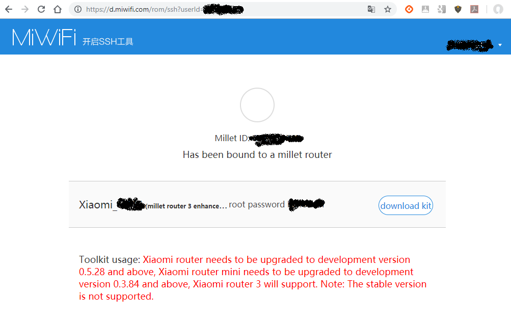

## Additional Info

### SSH tool:
Based on Chinese instructions from http://bbs.xiaomi.cn/t-10044297 

The SSH tool is downloadable from Xiaomi, here: http://www1.miwifi.com/miwifi_open.html, which redirects to https://d.miwifi.com/rom/ssh  
Make sure to change the protocol in http*s*, each time you get a `CONN_REFUSED`   
Once authentified to Xiaomi, your URL will look like https://d.miwifi.com/rom/ssh/download?sn=98765%2F67890123&userId=1234567890

** MAKE SURE ** you copy the SSH password! Make a screen capture. Your google-translate screen will look like 

## Original reformatted text in French, from https://pastebin.com/YBkr88JX

Tuto pour l'installation du firmware alternatif Padavan pour le routeur Mi Wifi 3g de Xiaomi

La communauté m'ayant conduit à cet achat : https://www.dealabs.com/bons-plans/routeur-sans-fil-xiaomi-mi-wifi-router-3g-avec-4-antennes---gigabit-1167-mbps-dual-band-rom-128-mo-ram-256-mo-/393412

Préliminaire : faire vos updates Windows. Rien de plus rageant que Windows qui reboote tout seul alors que vous êtes en pleine compilation car il y a de nouvelles updates qui viennent d'arriver :p

Tout d'abord, il faut télécharger la version "dev" du firmware. La version "stable" ne permet pas d'accéder au ssh et donc de modifier les applications du routeur.

Pour effectuer ce téléchargement, vous devez être connecté à Internet SANS passer par votre routeur MiWifi. Connectez vous directement au WiFi de votre box ADSL par exemple.

Allez sur le site : http://www.miwifi.com/miwifi_download.html
* Cliquez sur "ROM"
* Allez jusqu'a la ligne "ROM for R3G" pour avoir le firware correspondant à notre routeur.
* Vous avez alors 2 boutons de téléchargement : 
   * Celui de gauche : c'est le firwmare "Stable"
   * Celui de droite : c'est le firmware "Dev"

On a besoin du firmware de "Dev". Cliquez sur le bouton bleu de la colonne de droite pour télécharger le fichier .bin

Une fois le téléchargement terminé, reconnectez vous au WiFi de votre routeur MiWifi

Se connecter à l'interface web du routeur : 192.168.31.1   
Mot de passe de connexion : mot de passe utilisé pour la clé wifi lors de la configuration du routeur.

Vous avez, en rouge : le modèle de votre routeur : R3G   
et la version actuelle du firmware installée : 2.24.10 pour mon cas.   
Cliquez sur "Configuration" (en jaune sur la capture)

Puis sur "Status" (en jaune sur la capture)

Il va falloir lancer la mise à jour du firwmare pour passer votre routeur en version "Dev"   
Sur la capture, il y a 2 boutons :
* Un bleu (face à la flèche rouge) : ce bouton permet de mettre à jour le firmware automatiquement car une version plus récente est disponible. Ce bouton n'apparait que si vous n'avez pas la dernière update du firmware installé sur votre routeur. Il se peut donc que vous ne l'ayez pas.
* Un gris (face à la flèche jause) : ce bouton permet de sélectionner le fichier de firmware à uploader. Cliquez dessus et sélectionnez le firmware "dev" que vous avez téléchargé plus haut et validez.

La mise à jour se lance et peut prendre une dizaine de minute. No stress, laissez votre routeur se mettre à jour avant de passer à la suite.

Une fois terminé, vous pouvez vous reconnecter au WiFi. Votre configuration SSID/Clé WPA a été sauvegardée, elle n'a donc pas changée avec le changement du firmware.

Votre routeur est à présent en version "Dev".

Il faut maintenant installer le service SSH.   
* Allez sur http://account.xiaomi.com et connectez vous (ou créez un compte pour vous connecter)
* Ensuite, utilisez l'application Mi WiFi de votre smartphone pour linker le compte créé avec votre routeur

Une fois connecté, allez sur http://d.miwifi.com/rom/ssh 

Vous allez alors arriver sur cette page :

Si vous n'avez pas cet écran, c'est que vous n'êtes pas connecté ou que votre compte n'est pas lié avec l'application du routeur.
* Les fléches en vert : votre identifiant
* La flèche en rouge : votre mot de passe root (Notez le et gardez le précieusement !!!)
* La flèche en jaune : le bouton télécharger pour récupérer le package SSH

Cliquez sur le bouton de téléchargement (flèche jaune) puis acceptez le contrat (bouton de droite sur le popup qui apparait)
* Prenez une clé USB de petite taille (maximum 16 Go) et formattez la en FAT32
* Copiez le fichier téléchargé sur la clé USB

* Déconnectez le cable d'alimentation du routeur
* Branchez la clé USB sur le port USB du routeur
* Appuyez sur le bouton de réinitialisation du routeur avec un objet pointu et maintenez le enfoncé
* Branchez le cable d'alimentation du routeur tout en maintenant le bouton de réinitialisation enfoncé
* Dès que la LED du routeur clignotte en orange, relachez le bouton de réinitialisation.
* Attendre que le routeur redémarre et retirez la clé USB

Le SSH est maintenant installé. Ne perdez pas votre mod de passe root !

Reconnectez vous au WiFi de votre routeur.

Maintenant, je vous conseille une sauvegarde des différentes partitions de votre routeur avant de faire quoi que ce soit.   
On va se connecter au routeur en SSH.   
* Sous Windows : téléchargez le logiciel putty, lancez le, et connectez vous à 192.168.31.1 - Login : root ; Password : celui que vous avez récupéré plus haut (le mot de passe ne s'affiche pas / n'affiche pas d'étoiles quand vous le tappez, c'est normal)
* Sous Linux : dans un terminal, tappez la commande : ssh root@192.168.31.1

Connectez une clé USB formatée en FAT32 sur le port USB du routeur. On va faire les sauvegardes sur la clé USB   
Pour voir si la clé est bien détectée, tappez cette commande :    
* `ls -la /extdisks/sda1/`   
Le contenu de la clé devrait s'afficher.

Sauvegardons maintenant les différentes partitions du routeurs. Tappez ces 4 commandes :
* dd if=/dev/mtd0 of=/extdisks/sda1/part0.bak
* dd if=/dev/mtd1 of=/extdisks/sda1/part1.bak
* dd if=/dev/mtd2 of=/extdisks/sda1/part2.bak
* dd if=/dev/mtd3 of=/extdisks/sda1/part3.bak
* dd if=/dev/mtd4 of=/extdisks/sda1/part4.bak
* dd if=/dev/mtd5 of=/extdisks/sda1/part5.bak
* dd if=/dev/mtd6 of=/extdisks/sda1/part6.bak
* dd if=/dev/mtd7 of=/extdisks/sda1/part7.bak
* dd if=/dev/mtd8 of=/extdisks/sda1/part8.bak
* dd if=/dev/mtd9 of=/extdisks/sda1/part9.bak
* dd if=/dev/mtd10 of=/extdisks/sda1/part10.bak
* dd if=/dev/mtd11 of=/extdisks/sda1/part11.bak
* dd if=/dev/mtd12 of=/extdisks/sda1/part12.bak
* dd if=/dev/mtd13 of=/extdisks/sda1/part13.bak
* dd if=/dev/mtd14 of=/extdisks/sda1/part14.bak

(il y aura peut être des erreurs sur certaines / elles n'existent pas toutes, c'est pas grave)

En retappant la commande "ls" citée plus haut, vous devriez voir les fichiers de backup sur votre clé USB.

Vous pouvez retirer la clé USB, et revérifier si vous voulez avec une autre machine que tout est bien dessus (on est jamais trop prudent :p)

Vous pouvez aussi en profiter pour changer le mot de passe root par celui de votre choix avec cette commande :
* `passwd`

Vous pouvez maintenant fermer votre connexion SSH au routeur avec cette commande :
* `exit`

* Téléchargez et installez VirtualBox : https://www.virtualbox.org/wiki/Downloads   
* Téléchargez la machine virtuelle VIRTUALBOX-PROMETHEUS-32.7z ici : https://yadi.sk/d/6EpD2EpHmB82o (si le lien ne fonctionne plus, allez sur http://prometheus.freize.net/ pour avoir le nouveau lien)   
* Décompressez le fichier téléchargé   
* Double cliquez sur PROMETHEUS-32 (icone bleu) pour charger la machine virtuelle.   
* Mettez votre carte réseau sur laquelle votre routeur est connecté en bridge(pont) dans les paramètres de la machines virtuelle
cf capture : 

Lancez la machine virtuelle. Elle démarre, se mets à télécharger plein de chose. Tout est en Russe. Pas grave, patientez (ça peut être long) jusqu'a l'affichage d'un menu. Si vous avez des message d'erreur, c'est que vous n'êtes pas connecté en pont / que votre routeur n'est pas connecté à Internet. Vérifiez votre connexion / configuration de machine virtuelle

Dans le menu, cherchez "mi-r3g". Saisissez le numéro correspondant (probablement 33).   
Attention, le clavier est configuré par défaut en QWZERTY. Pour utiliser les chiffres du haut de votre clavier, pas besoin d'appuyer sur Shift/de passer en majuscule !

Un super menu s'affiche alors... en Russe...
* Appuyez sur "S" pour Settings (En majuscule !)
* Puis sur "4" pour modifier la langue
* Puis sur "3" pour choisir EN (anglais)

L'interface est déjà un peu plus compréhensible :D

Dans le récapitulatif en haut, on peut voir la config sélectionnée : MI-R3G, puis un numéro de série (SN) qui vaut --
* Appuyez sur "S" pour Settings (En majuscule !)
* Puis sur "5" pour SSH Settings (toujours sans faire Shift : vous êtes toujours en clavier QWERTY...)
* Patientez un peu, et là, le système vous dit que la connexion SSH a échoué.
* Faire "2" pour Update the parameters
* saisissez l'adresse ip de votre routeur : 192.168.31.1 (le . en QWERTY se fait avec la touche : de votre clavier)
* saisissez ensuite le login : root
* saisissez le mot de passe précédement récupéré (ou celui que vous avez mis si vous l'avez changé). Indice : 'a' est sur la touche 'q' et inversement ; 'w' est que la touche 'z' et inversement ; 'm' est sur la touche ','

Si la saisie est correct, PROMETHEUS vous dit qu'il a réussi à se connecté en SSH (sinon, recommencez)   
* Faire "1" : The parameters are correct

Le menu s'affiche de nouveau, mais le numéro de série n'est toujours pas là
* Faire : "1" : Change routeur configuration
* Sélectionnez de nouveau le routeur "mi-r3g" dans la liste (33)

Le menu s'affiche, le numéro de série est renseigné, parfait.

Nous allons maintenant lancer les mises à jour.
* Faire "1" : Update scripts
* Puis "2" : Update the script to a test version (la version stable ne semble pas dispo, mais vous pouvez tester quand même et changer plus tard)
* Faire "2" : Update sources
Il y a de forte chance que tout soit déjà à jour, mais on sait jamais. Revenez au menu.

En haut du menu, s'affiche : Toolchain : NONE => vous n'avez pas la toolchain.
* Faire "3" pour la télécharger et l'installer
* Le téléchargement, la compilation et l'installation est très (très) long. Laissez le système faire et revenez plus tard.   
(no stress vi vous voyez des Warnings / des messages d'Erreur)
* La compilation doit se finir par "All IS DONE! Toolchain: OK"

Retournez au menu, et vous voyez : "Toolchain: Ok" ce coup là, mais Firmware est toujours sur NONE.   
Nous allons donc nous attaquer à la compilation du Firmware.

Faire "4" Firmware
* Puis "1" Change build config
* Puis "2" Edit config in a notepad
* Un éditeur va s'ouvrir. Cherchez la ligne "CONFIG_FIRMWARE_INCLUDE_LANG_FR=y"
* Devant cette ligne, il y a un caractère "#". Supprimez-le. Ca permettra d'avoir le Français dans votre firmware
* Faire "F2" pour Enregistrer le fichier (puis le bouton de gauche dans le popup Russe), puis "F10" pour quiter
* Faire "Q" pour revenir au menu précédent (donc A majuscule en QWERTY)
* puis "2" : Apply skins   
   => Passez en ON tous les skins (si vous les voulez, mais pour le peu de place que ça prends...)
* Une fois tous les skins sélectionnés, faites "Q" pour revenir au menu précédent
* puis "3" : Build a Firmware (ca va encore compiler... Vous allez devoir encore patienter très très longtemps...)

A la fin de la compilation, le message "Firmware: MI-R3G_xxxxxxxx.trx" apparait. Le Firmware a bien été créé !

de retour a menu, en haut, tout est ok : 
config : MI-R3G
SN: xxxxx/xxxxxxxx
GIT=xxxxxxx
Toolchain: OK
Firmware: MI-R3G_x.x.x.x-xxx.trx
Skin: FULL-TP

Faire "4" : Flash a firmware.

Do you want to backup all partitions ? => n (on l'a déjà fait sur la clé USB plus haut)
Are really want to flash it anyway ? => y
(perso, ça n'est pas passé la première fois, erreur de config. La seconde fois, c'était bon...)
Do you want to reboot the routeur ? => y

La mise à jour est terminée \o/ Votre routeur fonctionne maintenant sous PROMETHEUS
Attendez qu'il reboot et reconnectez vous dessus.
Si vous etes en WiFi : le SSID s'appelle maintenant "ASUS" (ou "ASUS 5G"). La Clé WiFi est : 1234567890

ouvrez une page web vers http://192.168.1.1
Login : admin
Password : admin

Tadam... ça fonctionne, et l'interface est en Français \o/
Vous n'avez plus qu'a configurer votre routeur selon la configuration de votre choix.

ATTENTION : Si vous avez branché votre routeur après votre box opérateur, il se peut que la box opérateur soit aussi en 192.168.1.x
Vous aurez alors un conflit de réseau / d'IP.
Il suffit de modifier le sous réseau de votre routeur :
Cliquez sur l'icone "WiFi" (le deuxieme de la liste)
Puis dans "Configuration avancée..." sur "Adresse IP du réseau local"
Changez l'adresse IP de "192.168.1.1" en "192.168.31.1" par exemple (laissez le masque en 255.255.255.0)
Faites "Appliquer". Le routeur va redémarrer. Une fois redémarré, déconnectez votre wifi (ou cable) et reconnectez vous.
Tout fonctionnera de nouveau.
</pre>
</body>
</html>
